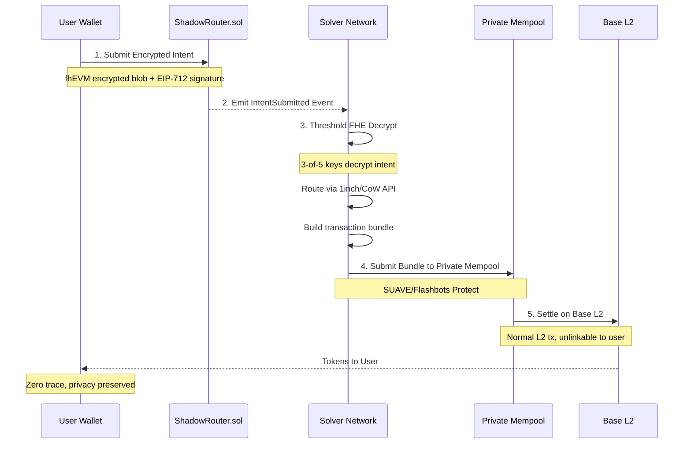
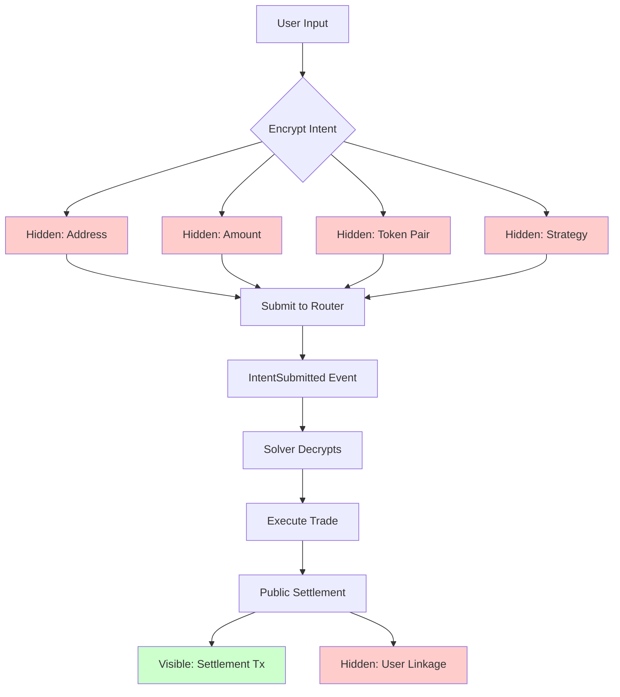
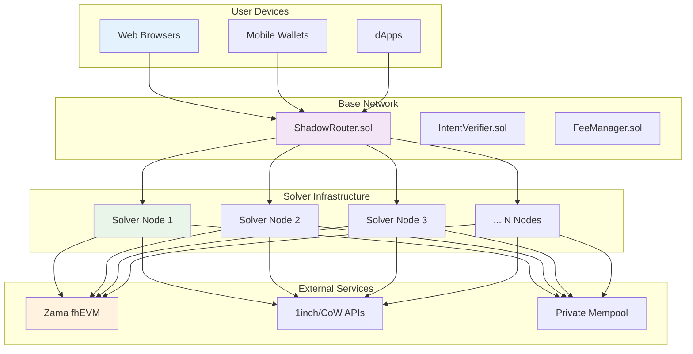

# Shadow Protocol Diagrams

This document contains Mermaid diagrams illustrating the Shadow Protocol architecture and flow.

## 4-Step Flow Diagram



## Layered Architecture Diagram

```mermaid
graph TB
    subgraph User Layer
        A[Wallet/dApp Integration]
        B[Next.js + wagmi + Shadow SDK]
        C[TypeScript SDK: swapPrivately()]
    end

    subgraph Protocol Layer
        D[ShadowRouter.sol on Base]
        E[Intent Submission & Verification]
        F[Solidity + Zama fhEVM]
    end

    subgraph Execution Layer
        G[Rust Solver Nodes]
        H[Threshold FHE Decryption]
        I[DEX Routing + Bundle Creation]
        J[SUAVE/Flashbots Private Mempool]
    end

    subgraph Settlement Layer
        K[Base L2 Public Settlement]
        L[Normal Transaction Calldata]
        M[Unlinkable to User]
    end

    A --> D
    B --> D
    C --> D
    D --> G
    E --> H
    F --> I
    G --> J
    H --> J
    I --> J
    J --> K
    K --> L
    L --> M

    style A fill:#e1f5fe
    style D fill:#f3e5f5
    style G fill:#e8f5e8
    style K fill:#fff3e0
```

## Component Interaction Diagram

```mermaid
graph LR
    subgraph Frontend
        FE[Next.js App]
        WC[Wallet Connect]
        SF[Swap Form]
    end

    subgraph SDK
        SDK[Shadow SDK]
        ENC[Encryption Module]
        SUB[Submission Module]
    end

    subgraph Contracts
        SR[ShadowRouter.sol]
        IV[IntentVerifier.sol]
        FM[FeeManager.sol]
    end

    subgraph Solvers
        SN[Solver Network]
        DEC[Decryption Service]
        RT[Routing Engine]
        BC[Bundle Creator]
    end

    subgraph Infrastructure
        RPC[Base RPC]
        DEX[DEX APIs]
        PM[Private Mempool]
    end

    FE --> WC
    FE --> SF
    SF --> SDK
    SDK --> ENC
    SDK --> SUB
    ENC --> SR
    SUB --> SR
    SR --> IV
    SR --> FM
    SN --> DEC
    SN --> RT
    SN --> BC
    DEC --> SR
    RT --> DEX
    BC --> PM
    PM --> RPC

    style FE fill:#bbdefb
    style SDK fill:#c8e6c9
    style SR fill:#ffcdd2
    style SN fill:#fff9c4
    style RPC fill:#d1c4e9
```

## Privacy Flow Diagram



## Deployment Architecture Diagram


